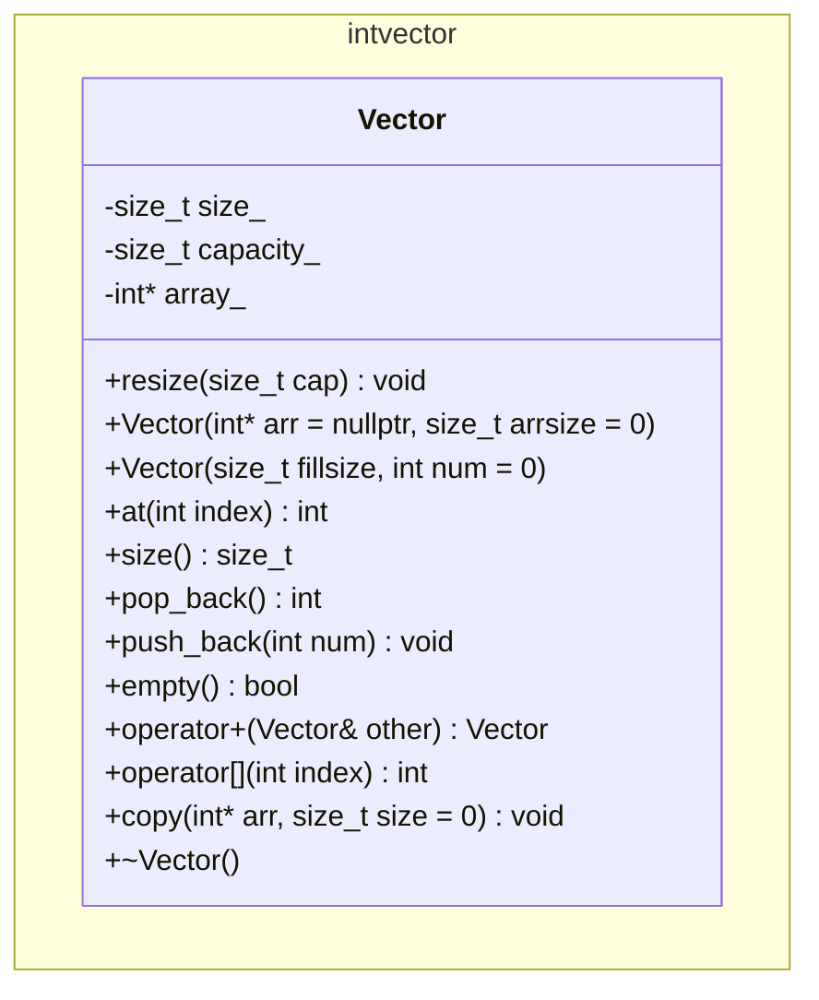

```mermaid
classDiagram
    namespace intvector {
        class Vector {
            -size_t size_
            -size_t capacity_
            -int* array_
            +resize(size_t cap) void
            +Vector(int* arr = nullptr, size_t arrsize = 0)
            +Vector(size_t fillsize, int num = 0)
            +at(int index) int
            +size() size_t
            +pop_back() int
            +push_back(int num) void
            +empty() bool
            +operator+(Vector& other) Vector
            +operator[](int index) int
            +copy(int* arr, size_t size = 0) void
            +~Vector()
        }
    }
```
